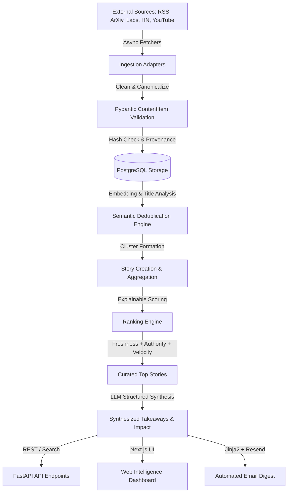

# System Architecture & Design Specification

## 1. Architectural Principles

The AI News Intelligence Platform is engineered according to clean architecture and hexagonal (ports & adapters) principles:

1. **Independent Core Domain**: Business rules, content models, and scoring algorithms are decoupled from external frameworks, database drivers, and third-party APIs.
2. **Provider Agnosticism**: AI/LLM components communicate via abstract provider interfaces (`LLMProvider`), allowing dynamic swapping between OpenAI, Anthropic, Gemini, or local models without code modification.
3. **Strict Ingestion Isolation**: Individual source scrapers/adapters are isolated; failure or malformed payload in one feed never cascades to halt the overall ingestion pipeline.
4. **Idempotence & Provenance**: Every incoming item receives a canonical content hash. Duplicate arrivals are tracked without uncontrolled database bloat, and generated intelligence retains absolute provenance linking back to primary sources.
5. **Separation of Layers**:
   - `API`: Route definitions, request validation, serialization, authentication.
   - `Services`: Orchestration, business logic, curation workflows.
   - `Domain`: Enterprise models, immutable value objects, domain rules.
   - `Data Access`: SQLAlchemy 2.x repositories, migrations, database sessions.
   - `Ingestion`: Source fetchers, parsers, HTML cleaners, canonicalizers.
   - `AI`: Structured LLM calls, embedding generation, semantic clustering.
   - `Infrastructure`: Scheduling, external HTTP clients, cache, email dispatch.

---

## 2. Layered Module Structure

```text
backend/app/
├── api/                   # Presentation Layer (FastAPI Routers)
│   ├── routes/
│   │   ├── health.py      # Health & readiness checks
│   │   ├── news.py        # Raw & normalized news query endpoints
│   │   ├── stories.py     # Clustered story endpoints
│   │   └── subscriptions.py # Digest subscription management
│   └── v1_router.py       # API v1 aggregator
├── core/                  # Cross-cutting concerns
│   ├── config.py          # Pydantic Settings & environment validation
│   ├── logging.py         # Structured JSON logging
│   └── security.py        # Token / API key verification
├── domain/                # Enterprise Business Entities
│   ├── models/            # Domain models (ContentItem, Story, Source, etc.)
│   └── value_objects/     # Enums, Canonical URLs, Score breakdowns
├── services/              # Application Orchestration
│   ├── curation.py        # Daily / weekly top story curation
│   ├── ranking.py         # Multi-factor scoring engine
│   └── digest.py          # Email compilation service
├── ingestion/             # Source Ingestion Adapters
│   ├── base.py            # Abstract IngestionAdapter
│   ├── rss.py             # RSS / Atom parser adapter
│   ├── official_labs.py   # Lab scrapers (OpenAI, DeepMind, Anthropic)
│   ├── arxiv.py           # ArXiv API searcher (cs.AI, cs.CL, cs.CV)
│   ├── hackernews.py      # Algolia / Firebase HN reader
│   └── youtube.py         # Transcript fetcher
├── ai/                    # LLM & Embedding Abstractions
│   ├── base.py            # Abstract LLMProvider interface
│   ├── providers/         # Concrete providers (OpenAI, Gemini, etc.)
│   ├── deduplication.py   # Semantic clustering & vector similarity
│   └── summarizer.py      # Structured summary generation
└── infrastructure/        # External Systems & Adapters
    ├── database/          # SQLAlchemy async engine, SessionLocal, Base, mixins
    ├── models/            # ORM models (Source, Story, ContentItem)
    ├── repositories/      # Decoupled Repository interfaces (SourceRepo, ContentRepo, StoryRepo)
    ├── email/             # Resend client + Jinja2 email templates
    └── scheduler/         # Background periodic job coordinator
```

---

## 3. Source Registry Architecture (Phase 2)

The Source Registry forms the central configuration and metadata backbone for ingestion pipelines:

```text
[ FastAPI REST Routes: /api/v1/sources ]
                   │
                   ▼ (DTOs: SourceCreate, SourceUpdate, SourceResponse)
[ Application Service: SourceService ]
  - Duplicate URL & Slug Conflict Detection
  - Business Rule Validation (interval >= 5m, score 0.0-1.0)
  - Lifecycle Transitions (Enable / Disable)
  - Baseline Idempotent Seeding
                   │
                   ▼ (Domain Entity / Domain Model)
[ Repository Layer: SourceRepository ]
  - Parameterized Queries (get_by_id, get_by_slug, get_by_url)
  - Multi-Criteria Filtering (by type, by enabled state)
  - Keyset & Offset Pagination with Total Counts
                   │
                   ▼ (SQLAlchemy 2.0 Async Session)
[ PostgreSQL 18: `sources` Table ]
  - Check Constraints (`ck_source_reliability_score`, `ck_source_fetch_interval_minutes`)
  - Indexed Slugs, Types, and Enabled Flags
  - Extensible JSON Configuration for Ingestion Parameters
```

### Supported Source Types
1. `RSS`: Standard RSS 2.0 and Atom XML feeds (blogs, newsletters, tech publications).
2. `WEB`: Web portal and landing page scrapers with configurable parser targets.
3. `ARXIV`: ArXiv preprint query endpoints and category filters (`cs.AI`, `cs.CL`, `cs.CV`).
4. `YOUTUBE`: Video feeds and channel uploads for automated transcript processing.
5. `GITHUB`: Repository trending and release track feeds.

### Ingestion Engine Decoupling
---

## 4. Ingestion Pipeline & Adapter Architecture (Phases 3, 4, 5, 6, & 7)

The ingestion subsystem decouples feed fetching, normalization, and persistence across multiple adapter types:

```text
[ Source Registry (Enabled Sources: RSS, WEB, ARXIV, YOUTUBE) ]
                          │
                          ▼
[ Ingestion Orchestrator: IngestionOrchestrator ]
  - Dispatches by SourceType & adapter_type config (RSS, Official WEB, ARXIV, Hacker News, YouTube)
  - Cross-source URL collision resolution (falls back to discussion URL if link owned by another source)
  - Dynamic metrics change detection (updates score/comments/views/likes without duplicate rows)
  - Per-source fault isolation (one failed feed never blocks others)
  - Updates `last_fetched_at` timestamp on completion
                          │
         ┌────────────────┼────────────────────────┬────────────────────────┬────────────────────────┐
         ▼                ▼                        ▼                        ▼                        ▼
[ RSSAdapter ]   [ OfficialWebAdapter ]    [ ArXivAdapter ]        [ HackerNewsAdapter ]   [ YouTubeAdapter ]
  - RSS 2.0/Atom   - feed_url priority       - Official Query API    - Firebase REST API     - Official Data API v3
  - XML parsing    - Anthropic HTML cards    - Atom XML parser       - Concurrency (15)      - Uploads playlist
  - Fallbacks      - Generic card parser     - Identity & versioning - AI keyword filter     - Batch video stats
         │                │                        │                        │                        │
         └────────────────┼────────────────────────┴────────────────────────┴────────────────────────┘
                          ▼
[ Normalization & Canonicalization ]
  - URL canonicalization (stripping tracking params, versionless ArXiv URLs, youtube.com/watch?v=...)
  - Deterministic SHA-256 content fingerprinting
                          │
                          ▼ (NormalizedArticle Stream)
[ Idempotency & Persistence Engine ]
  - Lookup by canonical_url OR (source_id, external_id)
  - Match hash & identical metrics -> skip (0 duplicate writes)
  - Diff hash -> update existing record (version update)
  - Dynamic metrics changed (score/comments/views/likes) -> update metadata_json in place
  - Missing -> insert new `ContentItem`
                          │
                          ▼ (PostgreSQL 18)
[ `content_items` Table ]
```

---

## 5. Data Access & Model Foundation

### Core Database Entities
1. **`Source`**:
   - Upstream content registry (RSS feeds, official AI labs, ArXiv category endpoints, YouTube channels, Hacker News).
   - Tracks `slug`, `type`, `url`, `reliability_score`, `fetch_interval_minutes`, and source-specific configuration payloads (`config`).
2. **`Story`**:
   - Represents a unified, deduplicated event/narrative synthesized from one or more raw articles.
   - Stores `headline`, `summary`, `key_takeaway`, `why_it_matters`, `importance_score`, `category`, and curation flags.
3. **`ContentItem`**:
   - Raw ingested evidence preserving full provenance.
   - Contains `source_id` foreign key, `story_id` foreign key (cluster assignment), `canonical_url` (unique index), `content_hash` (SHA-256 fingerprint), `raw_content`, `published_at`, and raw metadata JSON.

### Repository Pattern Decoupling
To prevent route handlers from performing raw SQL queries:
- `BaseRepository[T]`: Generic async CRUD operations (`get_by_id`, `list_all`, `add`, `delete`).
- `SourceRepository`: Slug lookup, enabled sources filtering, type queries.
- `ContentRepository`: Canonical URL resolution, hash deduplication lookup, source content retrieval.
- `StoryRepository`: Eager-loading of child articles via `selectinload`, curated story rankings, chronological timeline queries.

---

## 4. Operational Probes: Liveness vs. Readiness

- **Liveness Probe (`GET /health`, `GET /api/v1/health`)**:
  - Purpose: Validates that the application server process is running, not deadlocked, and capable of processing HTTP requests.
  - Contract: Returns `200 OK` with `{ status: "healthy", checks: { "api": "operational" } }`.
- **Readiness Probe (`GET /ready`, `GET /api/v1/ready`)**:
  - Purpose: Validates that the application and its critical external dependencies (PostgreSQL database) are ready to accept customer traffic.
  - Contract:
    - If database is connected: returns `200 OK` with `{ status: "ready", checks: { "api": "operational", "database": "connected" } }`.
    - If database is unreachable: returns `503 Service Unavailable` with `{ status: "degraded", checks: { "api": "operational", "database": "unavailable" } }` and sanitized error code.

---

## 5. Data Flow & Processing Pipeline



---

## 4. Deduplication & Story Intelligence Strategy

- **Level 1: URL Normalization**: Canonicalize query parameters, tracking UTM tags, and redirect targets.
- **Level 2: Content Hashing**: SHA-256 fingerprint of normalized text for instant exact duplicate suppression.
- **Level 3: Cross-Source Semantic Clustering**:
  - Generation of dense vector embeddings for title + summary.
  - Cosine distance thresholding combined with temporal windowing (e.g. 72-hour clusters).
  - Clustering assigns individual `ContentItem` rows to a unified `Story` parent without destroying raw source provenance.

---

## 5. Technology Choices & Justification

- **Python 3.11+ / FastAPI**: Superior async I/O throughput, automatic OpenAPI documentation, native Pydantic v2 support.
- **SQLAlchemy 2.0 (Async) + Alembic**: Robust database migration management, type safety, asynchronous query execution via `asyncpg`.
- **PostgreSQL + pgvector**: Unified relational store with native vector similarity operations, avoiding unnecessary external vector database operational overhead for baseline.
- **Next.js (App Router, React, Tailwind CSS)**: Server-side rendering for optimal SEO and performance, rapid development of high-density intelligence interfaces.

---

## 6. Unified Content Model & Canonical Ingestion Contracts (Phase 8)

The platform enforces a single canonical content contract across every ingestion family (RSS, Official AI Labs, ArXiv, Hacker News, YouTube). This guarantees that downstream Phase 9 AI processing, semantic deduplication, and ranking consume uniform entities without source-specific branching:

```text
               [ Multi-Source Ingestion Pipeline ]
  RSS / Atom       Official Labs       ArXiv Preprints   Hacker News     YouTube
 (RSSAdapter)   (OfficialWebAdapter)   (ArXivAdapter)    (HNAdapter)  (YouTubeAdapter)
       │                 │                   │                │              │
       ▼                 ▼                   ▼                ▼              ▼
  [ARTICLE]          [ARTICLE]       [RESEARCH_PAPER] [COMMUNITY_POST]    [VIDEO]
       │                 │                   │                │              │
       └─────────────────┴───────────┬───────┴────────────────┴──────────────┘
                                     ▼
                    Canonical Entity: `NormalizedArticle`
                                     │
                    ┌────────────────┴────────────────┐
                    │ canonical_url: str              │
                    │ title: str                      │
                    │ summary: Optional[str]          │
                    │ raw_content: Optional[str]      │
                    │ author: Optional[str]           │
                    │ published_at: datetime (UTC)    │
                    │ fetched_at: datetime (UTC)      │
                    │ content_hash: str (SHA-256)     │
                    │ content_type: ContentType (Enum)│
                    │ thumbnail_url: Optional[str]    │
                    │ categories: List[str]           │
                    │ metadata_json: Dict[str, Any]   │
                    └────────────────┬────────────────┘
                                     │
                                     ▼
                         [ PostgreSQL 18 Storage ]
                             `content_items`
                                     │
                                     ▼
                  [ Ready for Phase 9 AI Intelligence ]
```

### Canonical Field Specifications
1. **`content_type`**: Enumerated classification (`ARTICLE`, `RESEARCH_PAPER`, `VIDEO`, `COMMUNITY_POST`). Indexed in PostgreSQL for high-efficiency querying and filtering.
2. **`thumbnail_url`**: Dedicated canonical column for primary visual representations (YouTube thumbnails, article lead images, open graph cards).
3. **`metadata_json`**: Source-family-specific attributes preserved for specialized rendering and provenance (e.g. YouTube duration/view counts, ArXiv PDF links/DOIs, HN points/comment counts).

---

## 7. AI Processing Layer & Embedding Abstraction (Phase 9)

Phase 9 establishes the foundational intelligence extraction and vector generation pipeline:

```text
                    ┌──────────────────────┐
                    │    ContentItem       │
                    │  Canonical Model     │
                    └──────────┬───────────┘
                               │
                               ↓
                    ┌──────────────────────┐
                    │ AI Processing Service│
                    │  - Cost/token limits │
                    │  - Concurrency locks │
                    │  - Idempotency check │
                    └──────────┬───────────┘
                               │
                     ┌─────────┴─────────┐
                     ↓                   ↓
              ┌─────────────┐    ┌─────────────┐
              │ AI Provider │    │  Embedding  │
              │  Interface  │    │ Generation  │
              └──────┬──────┘    └──────┬──────┘
                     │                  │
                     ↓                  ↓
              ┌─────────────┐    ┌─────────────┐
              │   OpenAI    │    │   OpenAI    │
              │(or Offline  │    │(or Offline  │
              │MockProvider)│    │MockProvider)│
              └─────────────┘    └─────────────┘
                     │                  │
                     └────────┬─────────┘
                              ↓
                     ┌─────────────────┐
                     │   PostgreSQL    │
                     │                 │
                     │ ai_summary      │
                     │ ai_key_points   │
                     │ ai_topics       │
                     │ ai_relevance    │
                     │ embedding       │
                     │ processing_state│
                     └─────────────────┘
```

### Architectural Highlights
- **Provider Decoupling**: Business logic interacts exclusively with `BaseAIProvider`. `OpenAIProvider` implements structured chat completions and embedding generation with exponential retry backoff. `MockAIProvider` enables deterministic, keyless execution.
- **Cost & Token Control**: Inputs are strictly bounded (title + summary + max 3,000 char content excerpt). YouTube items are processed from metadata and descriptions without transcript scraping.
- **Database Vector Compatibility**: Non-destructive schema migration (`f3aa829c7102`) supports `Vector(1536)` with dual-environment support (native pgvector in Docker/Linux, and automatic compatible domain fallback on local Windows PG 18).
- **Concurrency & Fault Isolation**: Semaphore-bounded batch processing with per-item error isolation; failure in one item preserves raw source data without blocking batch progress.


